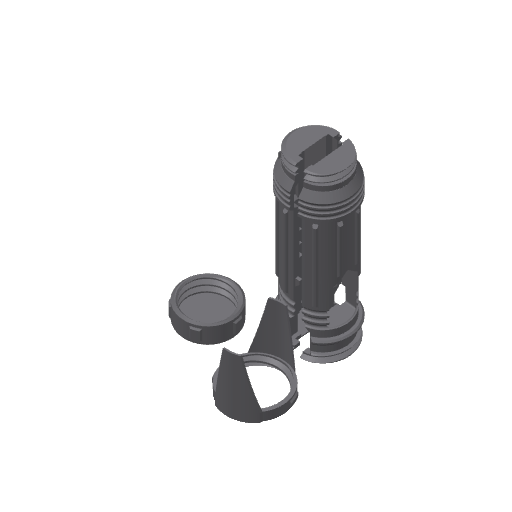
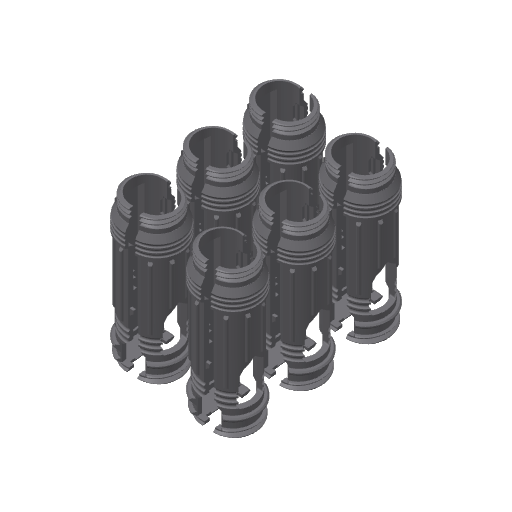
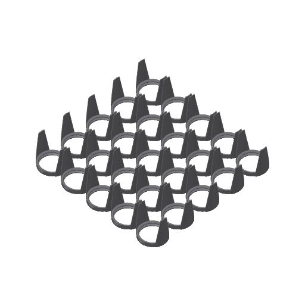
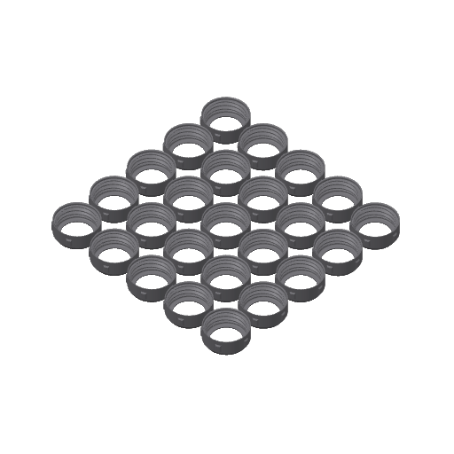
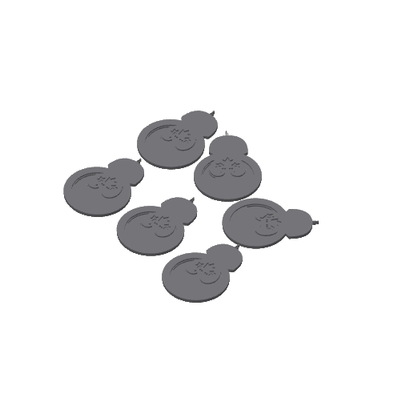

# BT5 Models

3D-print files for the **BT5** (Black Tuque 5) event swag: a lightsaber handle shell that closes around the saber, the BT5 coin, and a few extras. The files are set up for batch printing on a Bambu Lab X1 Carbon.

## Latest models for printing

Use [`Assembly_v3.3mf`](Assembly_v3.3mf) / [`Assembly_v3.gcode.3mf`](Assembly_v3.gcode.3mf) for printing. Assembly v3 is composed of:

- [`Bottom Fastener V5.stl`](Bottom%20Fastener%20V5.stl)
- [`Top Fastener B v3.stl`](Top%20Fastener%20B%20v3.stl)
- [`Bottom.stl`](Bottom.stl) (handle body bottom half)
- [`Top.stl`](Top.stl) (handle body top half)

| File | Type |
|---|---|
| [`Assembly_v3.3mf`](Assembly_v3.3mf) | Project (editable / re-slice) |
| [`Assembly_v3.gcode.3mf`](Assembly_v3.gcode.3mf) | Sliced, ready for X1 Carbon |

  

## Contents

- [Latest models for printing](#latest-models-for-printing)
- [What's in a handle](#whats-in-a-handle)
- [Printing a batch](#printing-a-batch)
- [Assembly](#assembly)
- [File catalog](#file-catalog)
- [File types and naming](#file-types-and-naming)
- [Print settings](#print-settings)
- [Known gaps](#known-gaps)
- [License](#license)

## What's in a handle

Each handle is four printed parts:

| Qty | Part | What it is |
|---|---|---|
| 1 | `Top` | One half of the handle body |
| 1 | `Bottom` | The other half of the handle body; mates with `Top` |
| 1 | Top fastener | Threaded ring with a shroud that screws onto the top of the closed body |
| 1 | Bottom fastener | Threaded ring that screws onto the bottom of the closed body |

The two body halves are printed together as one "Assembly" object, standing upright.

## Printing a batch

These are the current versions. The `.gcode.3mf` files are already sliced and can be sent straight to an X1 Carbon with a 0.4 mm nozzle; for any other printer, open the project file and re-slice.

| Part | Ready-to-print file | Parts per plate | Print time | PETG | Supports |
|---|---|---|---|---|---|
| Handle body v3 | [`6_handle_plate_v3.gcode.3mf`](6_handle_plate_v3.gcode.3mf) | 6 | 9 h 49 m | 235 g | Yes |
| Top fastener v3 | [`25_top_fastener_plate.gcode.3mf`](25_top_fastener_plate.gcode.3mf) | 25 | 4 h 42 m | 107 g | No |
| Bottom fastener v4 | [`25_bottom_fastener_plate_v4.gcode.3mf`](25_bottom_fastener_plate_v4.gcode.3mf) | 25 | 5 h 00 m | 101 g | No |

One plate of each fastener covers about four handle plates. A complete handle uses roughly 48 g of PETG.

## Assembly

1. Put the two halves of the handle body (`Top` and `Bottom`) together over the saber, lining the handle up with the saber's screen.
2. Screw the top fastener onto the top of the handle.
3. Screw the bottom fastener onto the bottom of the handle.

The fasteners are threaded and hold the two halves closed.

## File catalog

### Handle body

| File | Version | Type | Contents |
|---|---|---|---|
| [`6_handle_plate_v3.3mf`](6_handle_plate_v3.3mf) | v3 (current) | Project | 6 handle bodies (`Male_Top v3` + `Female_Bottom v3`) |
| [`6_handle_plate_v3.gcode.3mf`](6_handle_plate_v3.gcode.3mf) | v3 (current) | Sliced | Same plate, sliced: 9 h 49 m, 235 g |
| [`6_handle_plate.3mf`](6_handle_plate.3mf) | v2 (older) | Project | 12 handle bodies across 2 plates (`Male_Top_v2` + `Female_Bottom_v2`) |
| [`6_handle_plate.gcode.3mf`](6_handle_plate.gcode.3mf) | v2 (older) | Sliced | 6 v2 handle bodies: 10 h 31 m, 261 g |
| [`Bottom.stl`](Bottom.stl) | v3 (current) | Mesh | The handle body bottom half on its own |
| [`Top.stl`](Top.stl) | v3 (current) | Mesh | The handle body top half on its own |

### Fasteners

 

*Left: top fasteners. Right: bottom fasteners (v4).*

| File | Version | Type | Contents |
|---|---|---|---|
| [`25_top_fastener_plate.3mf`](25_top_fastener_plate.3mf) | v3 (current) | Project | 25 × `Top Fastener B v3` |
| [`25_top_fastener_plate.gcode.3mf`](25_top_fastener_plate.gcode.3mf) | v3 (current) | Sliced | Same plate, sliced: 4 h 42 m, 107 g |
| [`25_bottom_fastener_plate_v4.gcode.3mf`](25_bottom_fastener_plate_v4.gcode.3mf) | v4 (current) | Sliced | 25 × `Bottom Fastener v4`: 5 h 00 m, 101 g |
| [`Bottom Fastener V5.stl`](Bottom%20Fastener%20V5.stl) | v5 (current) | Mesh | Single bottom fastener |
| [`Top Fastener B v3.stl`](Top%20Fastener%20B%20v3.stl) | v3 (current) | Mesh | Single top fastener B |
| [`Top Fastener Z v1.stl`](Top%20Fastener%20Z%20v1.stl) | v1 | Mesh | Alternate top fastener Z |
| [`Bottom Fastener v3.stl`](Bottom%20Fastener%20v3.stl) | v3 (older) | Mesh | Single bottom fastener |
| [`30_bottom_fastener_plate.3mf`](30_bottom_fastener_plate.3mf) | v2 (older) | Project | 30 × `Bottom Fastener v2`, needs supports |
| [`30_bottom_fastener_plate.gcode.3mf`](30_bottom_fastener_plate.gcode.3mf) | v2 (older) | Sliced | Same plate, sliced: 8 h 29 m, 196 g |

### Single-handle projects

Useful for a one-off print or for seeing how the parts relate.

| | File | Version | Contents |
|---|---|---|---|
| | [`Assembly_v3.3mf`](Assembly_v3.3mf) | **v3 (latest)** | One complete set for printing: handle body, top fastener, bottom fastener |
| | [`Assembly_v3.gcode.3mf`](Assembly_v3.gcode.3mf) | **v3 (latest)** | Same set, sliced for X1 Carbon |
|  | [`FullHandleAssembly_v2.3mf`](FullHandleAssembly_v2.3mf) | v2 (older) | One complete set: handle body, `Top Fastener B v2`, `Bottom Fastener` |
|  | [`Saber_Handle.3mf`](Saber_Handle.3mf) | v1 (original) | The first design as five separate parts: `male_top`, `female_bottom`, `bottom_fastener`, `top_fastener_a`, `top_fastener_b` |

### Extras

| | File | Type | Contents |
|---|---|---|---|
|  | [`BT5 Coin.3mf`](BT5%20Coin.3mf) | Project | BT5 coin with the tuque logo and a "5". 25 coins across 3 plates (12, 1 and 12), in two variants |
| | [`BT5 Coin .2mm top.stl`](BT5%20Coin%20.2mm%20top.stl) | Mesh | The ".2mm top" coin variant on its own |
|  | [`Droid_rebel.3mf`](Droid_rebel.3mf) | Project | 6 flat droid-shaped tags with an embossed emblem and a hanging loop |
|  | [`Galaxy Martini.3mf`](Galaxy%20Martini.3mf) | Project | Round disc with the tuque logo |
|  | [`Lightsaber Stand.3mf`](Lightsaber%20Stand.3mf) | Project | Angled, slotted display stand for the lightsaber, needs supports |

## File types and naming

| Extension | Meaning |
|---|---|
| `.3mf` | Editable [Bambu Studio](https://bambulab.com/en/download/studio) project: models, plate layout and print settings. Open this to change or re-slice. |
| `.gcode.3mf` | Sliced plate, ready to send to the printer. Specific to the X1 Carbon with a 0.4 mm nozzle. |
| `.stl` | Raw mesh of a single part, for use in any slicer or CAD tool. |

A leading number in a file name is the number of parts on the plate (`25_top_fastener_plate` = 25 top fasteners). A `_vN` suffix is the design version; a file with no suffix holds an earlier version than its suffixed sibling.

## Print settings

All projects share the same base setup:

| Setting | Value |
|---|---|
| Slicer | Bambu Studio |
| Printer | Bambu Lab X1 Carbon, 0.4 mm nozzle |
| Process | `0.20mm Standard @BBL X1C` (0.2 mm layers) |
| Walls / infill | 2 walls, 15% infill |
| Material (handle parts) | Bambu PETG Basic |
| Bed (sliced plates) | Textured PEI Plate |
| Supports | On for the handle body, off for the v3 top and v4 bottom fasteners |

The extras (coin, droid tags, disc, stand) are set up with PLA filaments; check the filament assignment in each project before printing.

## Known gaps

- `Bottom Fastener v4` exists only as the sliced plate. The newest standalone bottom fastener mesh is [`Bottom Fastener V5.stl`](Bottom%20Fastener%20V5.stl).

## License

[Apache License 2.0](LICENSE)
